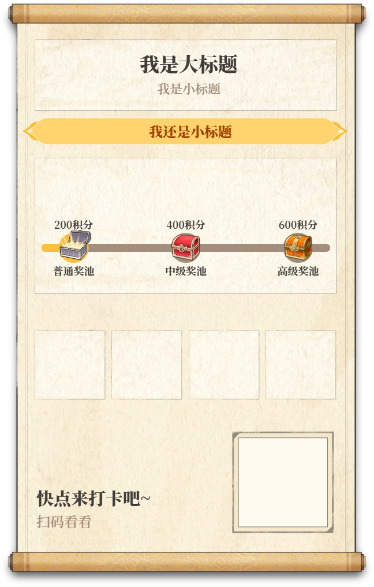

##  开篇
最近自己觉得很迷茫，没有什么技术热情，不知道该做些什么，就写写效率工具，并记录下来吧。

后面我会不定期写，一天1个、两天1个、三天1个甚至一周1个，都有可能。

今天先写一个吧：uniapp 海报生成 uni-wxml2canvas。


## ✨ 工具介绍
> 你是否在uni-app开发中遇到过这样的需求：需要将复杂的WXML结构转换为精美的海报图片？今天给大家推荐一款高效工具，让你轻松实现WXML到Canvas的转换！

`[uni-wxml2canvas](https://github.com/shenzhongchaoii/uni-wxml2canvas)` 是一个**声明式配置驱动**的uni-app工具库，它能将WXML结构通过Canvas渲染并导出为图片。特别适合生成分享海报、商品卡片等需要动态绘制的场景。

**核心优势**：

-   开箱即用，API简洁易上手
-   高性能渲染，支持多层叠加
-   支持多种元素类型（图片/文本/圆形/矩形/圆角矩形）
-   完美适配H5，微信小程序，支付宝小程序，百度小程序，字节跳动小程序，QQ小程序

## 📱平台兼容
注意：比如微信小程序需要配置 `downloadFile` 合法域名
|H5| 微信小程序| 支付宝小程序|百度小程序|字节跳动小程序|QQ 小程序|
| - | - | - | - | - | -
| √ | √ | √ | √ | √ | √ |


## 📦 安装指南

选择你喜欢的包管理器安装：
```bash
# npm
npm install uni-wxml2canvas@latest

# yarn
yarn add uni-wxml2canvas@latest

# pnpm
pnpm add uni-wxml2canvas@latest
```

## 🛠️ 配置详细

### canvasId：canvas-id的值
```html
<template>
  <canvas
    canvas-id="your canvasId"
    style="position: absolute; top: -99999rpx; width: 750rpx; height: 1334rpx; opacity: 0;"
  />
</template>
```

### options：描述最终要生成的图片中存在哪些内容

```typescript
export type W2CDrawType = 'IMAGE' | 'TEXT' | 'CIRCLE' | 'RECT' | 'ROUNDRECT'

export type W2COptions = Record<'width' | 'height', number> & Record<'wxml', W2CWxml | W2CWxml[]>

/** wxml 描述 */
export interface W2CWxml {
  type: W2CDrawType
  layer?: number // 层级控制，默认 1
  desc: // 类型专属配置
    | W2CDrawImage
    | W2CDrawText
    | W2CDrawCircle
    | W2CDrawRect
    | W2CDrawRoundRect
}

/** 绘制的起点、终点 */
export interface W2CDrawStartPosition {
  startX: number
  startY: number
}
```

#### layer

`layer` 是一个很重要的参数，可以用于控制层级。比如说：
第一种情况：绘制海报时，需要先渲染背景图，那么此时可以将其他 wxml 的 layer 值调大，绘制出来的效果就是背景图在下而其他在上；

第二种情况：绘制进度条时，需要先绘制进度条再绘制当前进度，那么就可以将当前进度的 layer 值调大，绘制处理的效果就是当前进度在上了。

#### type
`type` 分为五种类型，分别是：

元素类型          | 关键配置项                       | 说明                 |
| ------------- | --------------------------- | ------------------ |
| **IMAGE**     | `url`   | 图片URL         |
| **TEXT**      | `text`, `font`, `align` | 支持多行文 |
| **CIRCLE**    | `radius`      | 圆形半径          |
| **RECT**      | `width`, `height`           | 矩形宽高               |
| **ROUNDRECT** | `radius`                    | 圆角半径            |


#### TEXT 类型

用来绘制文本，支持多行文本控制（maxWidth、lineHeight)
```typescript
export interface W2CDrawText extends W2CDrawStartPosition {
  text: string
  font?: string
  align?: 'left' | 'center' | 'right'
  /** 支持 rgb、rgba、十六进制、颜色英文 */
  fillColor?: string
  maxWidth?: number
  lineHeight?: number
}
```

#### CIRCLE 类型

用来绘制圆，`fillColor` 用于控制填充色，`lineWidht`、`lineColor` 用于控制是否描边
```typescript
export interface W2CDrawCircle extends W2CDrawStartPosition {
  radius: number
  /** 支持 rgb、rgba、十六进制、颜色英文 */
  fillColor?: string
  lineWidth?: number
  lineColor?: string
}
```

#### RECT 类型

用来绘制矩形
```typescript
export interface W2CDrawRect extends W2CDrawStartPosition {
  width: number
  height: number
  /** 支持 rgb、rgba、十六进制、颜色英文 */
  fillColor?: string
  lineWidth?: number
  lineColor?: string
}
```

#### ROUNDRECT 类型

用来绘制圆角矩形
```typescript
export interface W2CDrawRoundRect extends W2CDrawRect {
  radius: number
}
```


## 💡 来个实际例子

### 代码（去掉了实际图片）
```html
<template>
  <view class="relative w-459rpx h-73rpx overflow-hidden">
    <button
      class="w-full h-70rpx flex-cc font-ss-h text-30rpx text-[#a14101]" 
      @click="onGenerate"
    >
      生成海报
    </button>
    <canvas
      canvas-id="poster-canvas"
      class="absolute top--99999rpx w-648px h-1016px opacity-0"
    ></canvas>
  </view>

  <uni-popup ref="PosterRef" mask-background-color="rgba(0, 0, 0, 0.6)" @change="">
    <view class="relative">
      <image
        :src="posterUrl"
        mode="aspectFit"
        show-menu-by-longpress
        class="w-648rpx h-1016rpx"
      ></image>
    </view>
  </uni-popup>
</template>

<script lang="ts" setup>
import { Wxml2Canvas, type W2CWxml } from '@tttiga/uni-wxml2canvas'

const PosterRef = ref()

const posterUrl = ref('')

const current = computed(() => 200)

const calculateNonLinearProgress = (currentValue: number, totalValue: number): number => {
  if (currentValue === 0) return 0

  if (currentValue >= totalValue) return 1

  const startPercent = 1 / 9 // 约11.11%
  const halfPercent = 0.5 // 50%
  const endPercent = 8 / 9 // 约88.89%

  if (currentValue <= 200) {
    // 到达 200，占 1/9
    if (currentValue <= 30) {
      return (30 / 200) * startPercent
    }
    return (currentValue / 200) * startPercent
  }

  if (currentValue <= 400) {
    // 从 200 到 400 的进度是从 1/9 到 1/2
    const ratio = (currentValue - 200) / 200
    return startPercent + ratio * (halfPercent - startPercent)
  }

  if (currentValue <= 600) {
    // 从 400 到 600 的进度是从 1/2 到 8/9
    const ratio = (currentValue - 400) / 200
    return halfPercent + ratio * (endPercent - halfPercent)
  }

  // 从 600 到 800 的进度是从 8/9 到 100%
  const ratio = (currentValue - 600) / 200
  return endPercent + ratio * (1 - endPercent)
}

const currentProgress = computed(() => {
  return calculateNonLinearProgress(current.value, 800)
})

const generatePoster = async () => {
  uni.showLoading({ title: '海报生成中...' })

  try {
    const texts: W2CWxml[] = [
      {
        type: 'TEXT',
        desc: {
          text: '我是大标题',
          startX: 327,
          startY: 124,
          font: `34px SourceHanSerifCN-Heavy`,
          align: 'center',
          fillColor: '#403d38',
        },
      },
      {
        type: 'TEXT',
        desc: {
          text: '我是小标题',
          startX: 327,
          startY: 162,
          font: `22px SourceHanSerifCN-SemiBold`,
          align: 'center',
          fillColor: '#a38d7d',
        },
      },
      {
        type: 'TEXT',
        desc: {
          text: '我还是小标题',
          startX: 330,
          startY: 237,
          font: `24px SourceHanSerifCN-Heavy`,
          align: 'center',
          fillColor: '#a14101',
        },
      },
      {
        type: 'TEXT',
        desc: {
          text: '快点来打卡吧~',
          startX: 63,
          startY: 874,
          font: `30px SourceHanSerifCN-Heavy`,
          align: 'left',
          fillColor: '#403d38',
        },
      },
      {
        type: 'TEXT',
        desc: {
          text: '扫码看看',
          startX: 63,
          startY: 912,
          font: `24px SourceHanSerifCN-SemiBold`,
          align: 'left',
          fillColor: '#a38d7d',
        },
      },
    ]

    const progress: W2CWxml = {
      type: 'ROUNDRECT',
      desc: {
        startX: 72,
        startY: 422,
        width: 500,
        height: 14,
        radius: 7,
        fillColor: '#a38d7d',
      },
    }

    const completedWidth = Math.min(currentProgress.value * 500, 500)
    const progressBar: W2CWxml = {
      type: 'ROUNDRECT',
      desc: {
        startX: 72,
        startY: 422,
        width: completedWidth,
        height: 14,
        radius: completedWidth ? 7 : 0,
        fillColor: '#fac13e',
      },
    }

    const milestones: W2CWxml[] = [
      { score: 200, label: '普通奖池', image: 'https://xxx.png', image2: 'https://xxx.png' },
      { score: 400, label: '中级奖池', image: 'https://xxx.png', image2: 'https://xxx.png' },
      { score: 600, label: '高级奖池', image: 'https://xxx.png', image2: 'https://xxx.png' },
    ]
      .map((item) => {
        // 计算里程碑位置
        const milestoneX =
          72 + Math.max(7, Math.min(500 - 7, calculateNonLinearProgress(item.score, 800) * 500))

        const isUnlocked = current.value < item.score
        const image = !isUnlocked ? item.image2 : item.image
        const imageWidth = 49
        const imageHeight = 47
        return [
          {
            type: 'IMAGE',
            layer: 3,
            desc: {
              url: image,
              startX: milestoneX - imageWidth / 2,
              startY: 429 - imageHeight / 2 - (!isUnlocked ? 8 : 0),
            },
          },
          {
            type: 'CIRCLE',
            layer: 2,
            desc: {
              startX: milestoneX,
              startY: 429,
              radius: 26,
              fillColor: !isUnlocked ? '#fac13e' : '#a38d7d',
              lineWidth: 0,
              lineColor: 'rgba(0, 0, 0, 0)',
            },
          },
          {
            type: 'TEXT',
            desc: {
              text: `${item.score}积分`,
              startX: milestoneX,
              startY: 396,
              font: `18px SourceHanSerifCN-Bold`,
              align: 'center',
              fillColor: '#403d38',
            },
          },
          {
            type: 'TEXT',
            desc: {
              text: item.label,
              startX: milestoneX,
              startY: 476,
              font: `18px SourceHanSerifCN-Bold`,
              align: 'center',
              fillColor: '#403d38',
            },
          },
        ] as W2CWxml[]
      })
      .flat(2)

    const wxml2canvas = new Wxml2Canvas('poster-canvas', {
      width: 648,
      height: 1016,
      wxml: [
        {
          type: 'IMAGE',
          layer: 0,
          desc: {
            url: 'https://xxxx.png',
            startX: 0,
            startY: 0,
          },
        },
        ...texts,
        progress,
        progressBar,
        ...milestones,
      ],
    })

    posterUrl.value = await wxml2canvas.generate()
  } catch (e) {
    console.error('海报生成失败', e)
    uni.showToast({
      title: '海报生成失败',
      icon: 'none',
    })
  } finally {
    uni.hideLoading()
  }
}

const onGenerate = async () => {
  await generatePoster()
  PosterRef.value?.open?.()
}
</script>
```

### 效果





